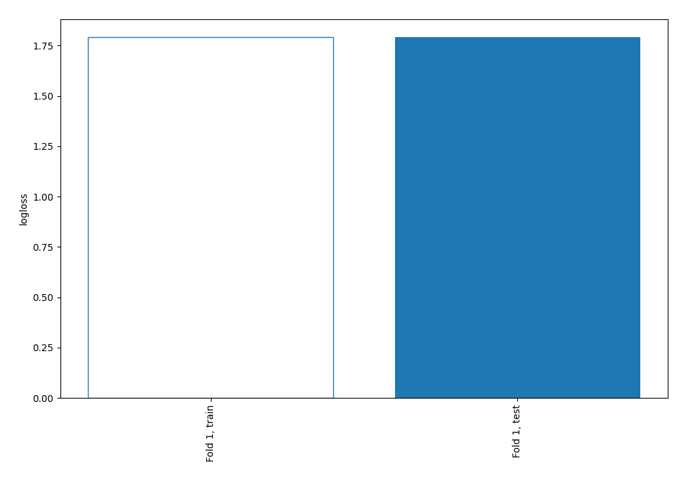
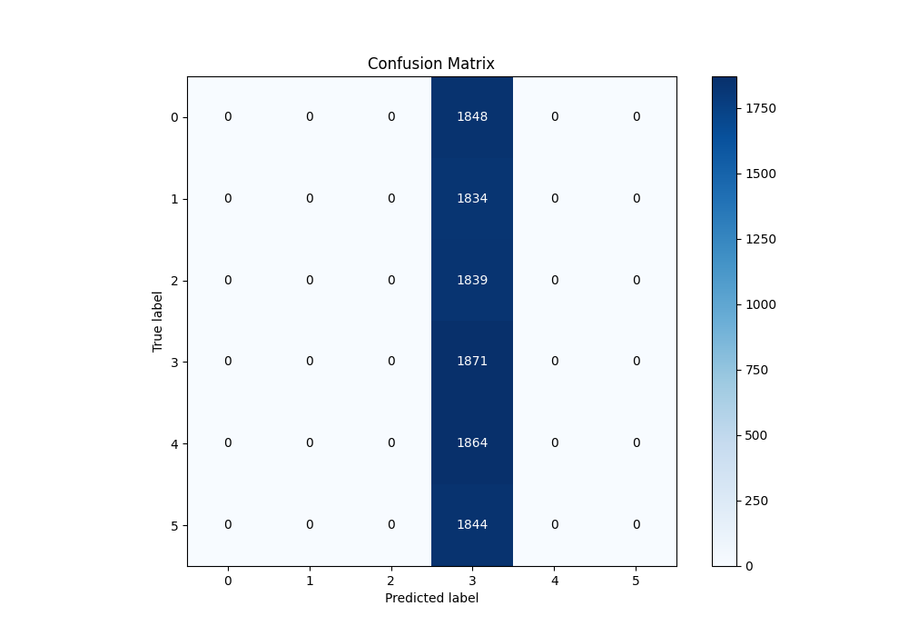
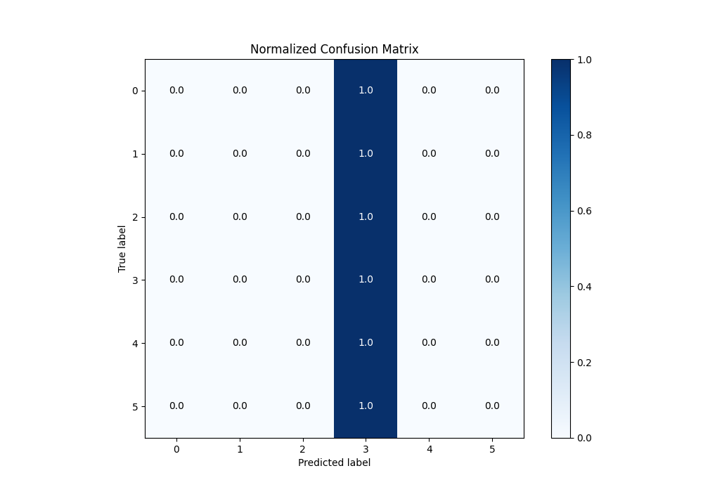
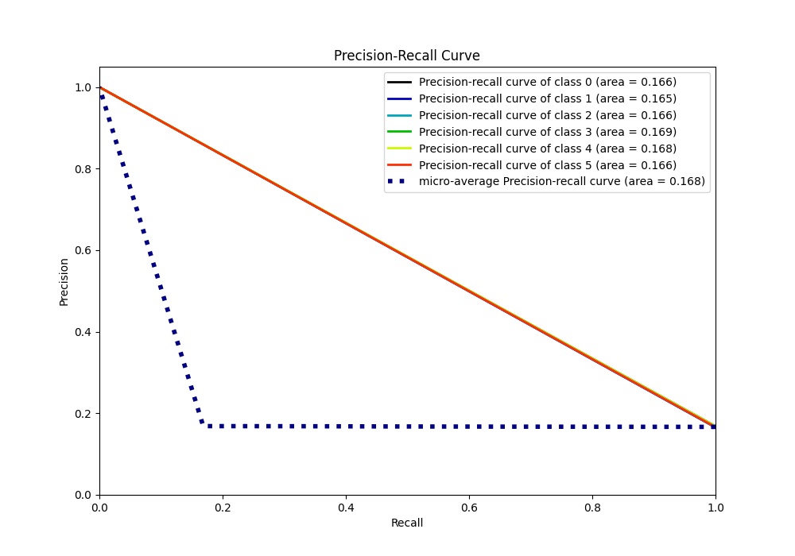

# Summary of 1_Baseline

[<< Go back](../README.md)

## Baseline Classifier (Baseline)
- **n_jobs**: -1
- **num_class**: 6
- **explain_level**: 2

## Validation
 - **validation_type**: split
 - **train_ratio**: 0.75
 - **shuffle**: True
 - **stratify**: True

## Optimized metric
logloss

## Training time

0.8 seconds

### Metric details
|           |    0 |    1 |    2 |           3 |    4 |    5 |   accuracy |     macro avg |   weighted avg |   logloss |
|:----------|-----:|-----:|-----:|------------:|-----:|-----:|-----------:|--------------:|---------------:|----------:|
| precision |    0 |    0 |    0 |    0.168559 |    0 |    0 |   0.168559 |     0.0280931 |      0.028412  |   1.79173 |
| recall    |    0 |    0 |    0 |    1        |    0 |    0 |   0.168559 |     0.166667  |      0.168559  |   1.79173 |
| f1-score  |    0 |    0 |    0 |    0.28849  |    0 |    0 |   0.168559 |     0.0480816 |      0.0486274 |   1.79173 |
| support   | 1848 | 1834 | 1839 | 1871        | 1864 | 1844 |   0.168559 | 11100         |  11100         |   1.79173 |

## Confusion matrix
|              |   Predicted as 0 |   Predicted as 1 |   Predicted as 2 |   Predicted as 3 |   Predicted as 4 |   Predicted as 5 |
|:-------------|-----------------:|-----------------:|-----------------:|-----------------:|-----------------:|-----------------:|
| Labeled as 0 |                0 |                0 |                0 |             1848 |                0 |                0 |
| Labeled as 1 |                0 |                0 |                0 |             1834 |                0 |                0 |
| Labeled as 2 |                0 |                0 |                0 |             1839 |                0 |                0 |
| Labeled as 3 |                0 |                0 |                0 |             1871 |                0 |                0 |
| Labeled as 4 |                0 |                0 |                0 |             1864 |                0 |                0 |
| Labeled as 5 |                0 |                0 |                0 |             1844 |                0 |                0 |

## Learning curves

## Confusion Matrix

## Normalized Confusion Matrix

## ROC Curve

## Precision Recall Curve

[<< Go back](../README.md)
