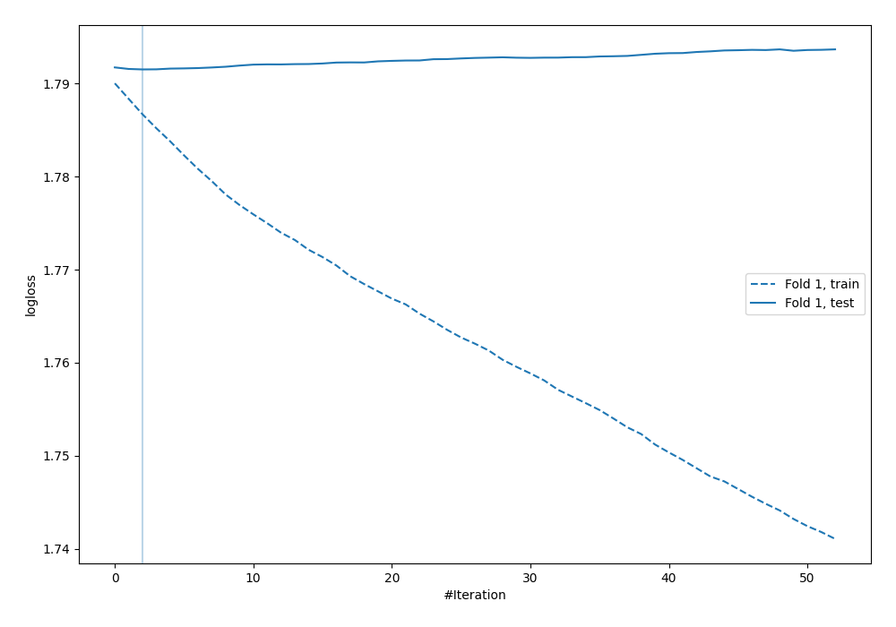
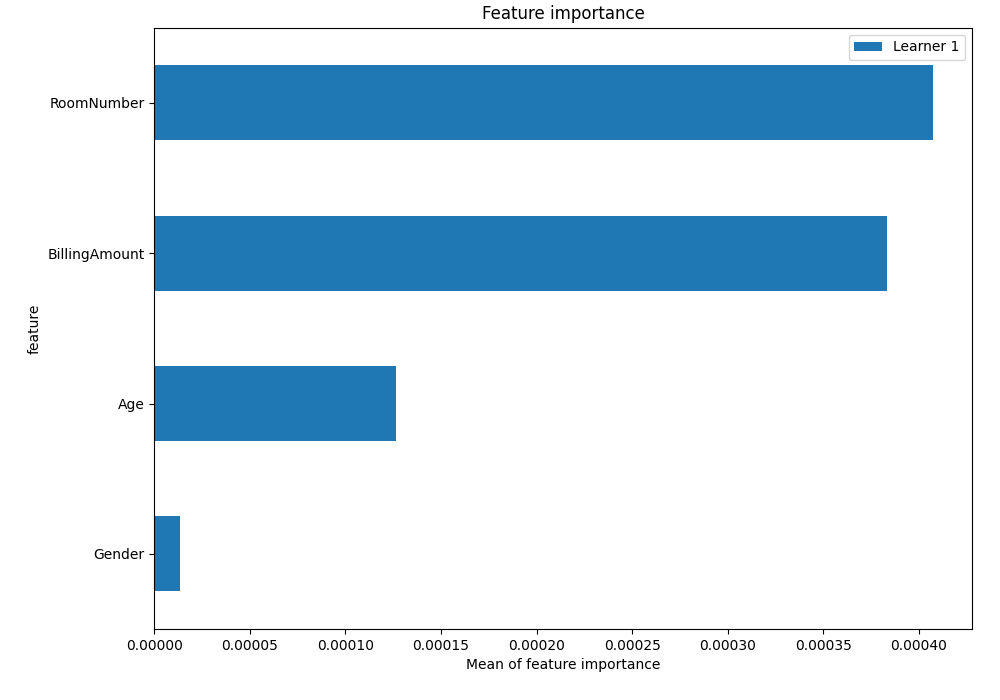
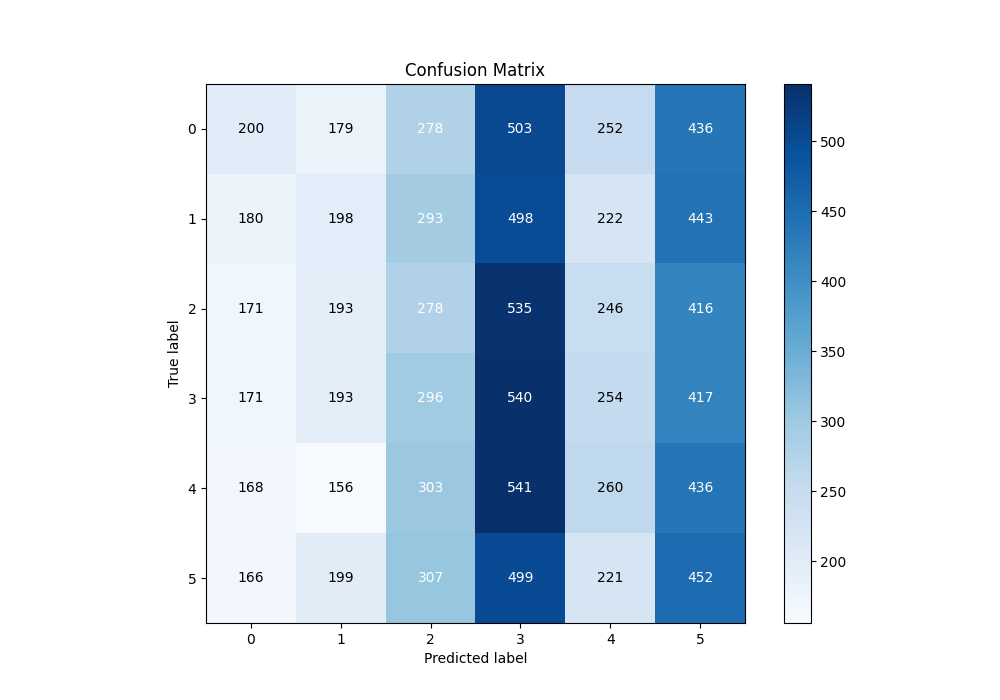
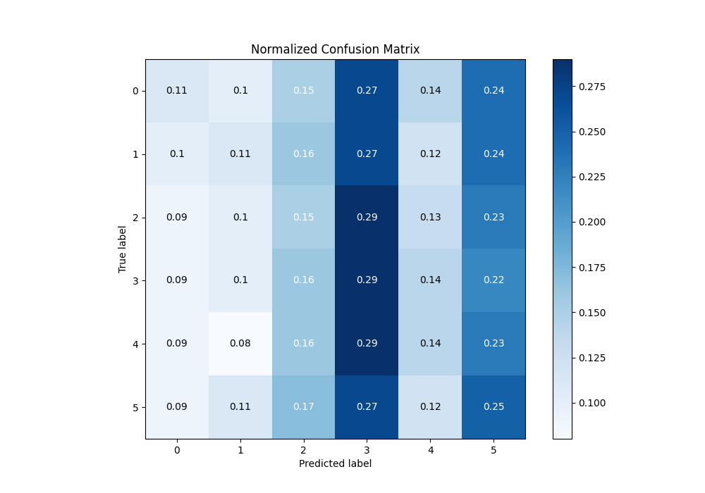
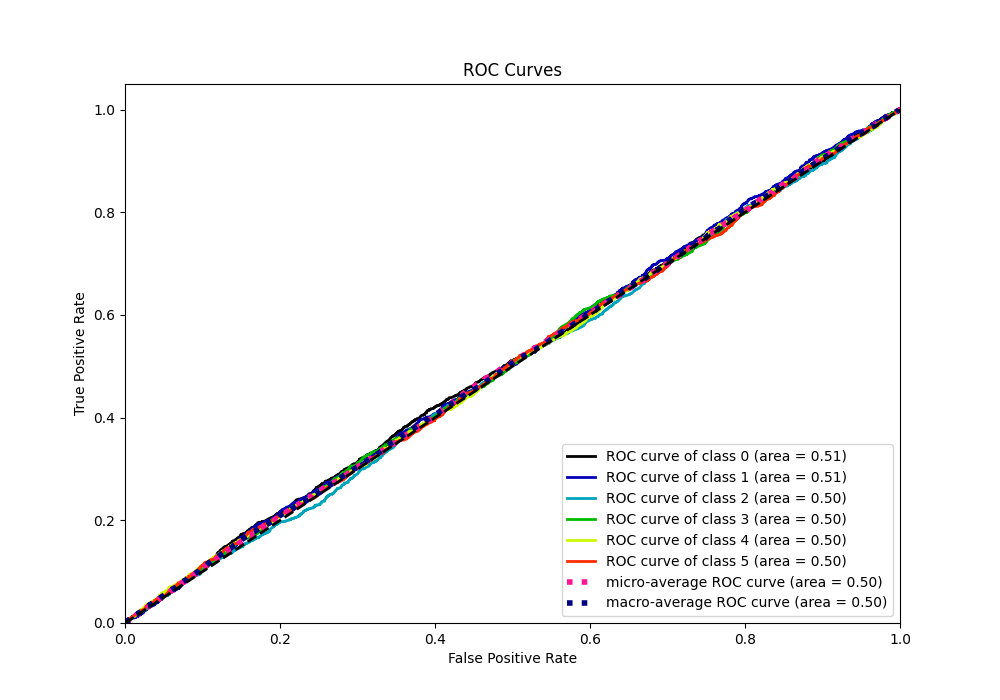
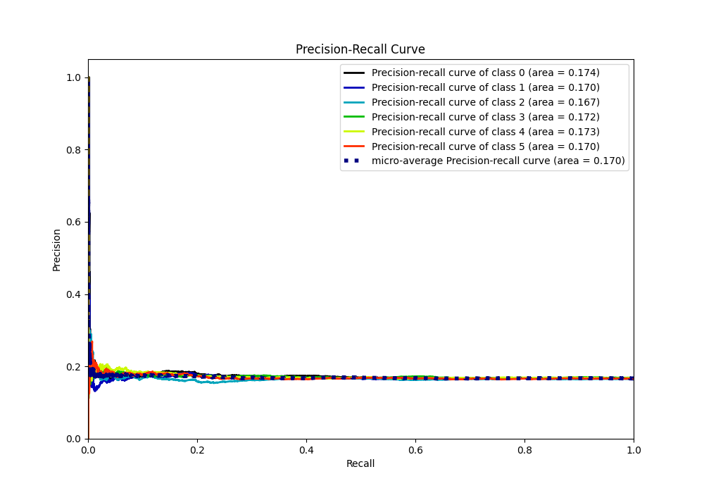

# Summary of 3_Default_Xgboost

[<< Go back](../README.md)

## Extreme Gradient Boosting (Xgboost)
- **n_jobs**: -1
- **objective**: multi:softprob
- **eta**: 0.075
- **max_depth**: 6
- **min_child_weight**: 1
- **subsample**: 1.0
- **colsample_bytree**: 1.0
- **eval_metric**: mlogloss
- **num_class**: 6
- **explain_level**: 2

## Validation
 - **validation_type**: split
 - **train_ratio**: 0.75
 - **shuffle**: True
 - **stratify**: True

## Optimized metric
logloss

## Training time

6.8 seconds

### Metric details
|           |           0 |           1 |           2 |           3 |           4 |           5 |   accuracy |    macro avg |   weighted avg |   logloss |
|:----------|------------:|------------:|------------:|------------:|------------:|------------:|-----------:|-------------:|---------------:|----------:|
| precision |    0.189394 |    0.177102 |    0.158405 |    0.173299 |    0.178694 |    0.173846 |   0.173694 |     0.175123 |       0.175136 |    1.7915 |
| recall    |    0.108225 |    0.107961 |    0.151169 |    0.288616 |    0.139485 |    0.245119 |   0.173694 |     0.173429 |       0.173694 |    1.7915 |
| f1-score  |    0.137741 |    0.134146 |    0.154702 |    0.216563 |    0.156674 |    0.20342  |   0.173694 |     0.167208 |       0.167334 |    1.7915 |
| support   | 1848        | 1834        | 1839        | 1871        | 1864        | 1844        |   0.173694 | 11100        |   11100        |    1.7915 |

## Confusion matrix
|              |   Predicted as 0 |   Predicted as 1 |   Predicted as 2 |   Predicted as 3 |   Predicted as 4 |   Predicted as 5 |
|:-------------|-----------------:|-----------------:|-----------------:|-----------------:|-----------------:|-----------------:|
| Labeled as 0 |              200 |              179 |              278 |              503 |              252 |              436 |
| Labeled as 1 |              180 |              198 |              293 |              498 |              222 |              443 |
| Labeled as 2 |              171 |              193 |              278 |              535 |              246 |              416 |
| Labeled as 3 |              171 |              193 |              296 |              540 |              254 |              417 |
| Labeled as 4 |              168 |              156 |              303 |              541 |              260 |              436 |
| Labeled as 5 |              166 |              199 |              307 |              499 |              221 |              452 |

## Learning curves

## Permutation-based Importance

## Confusion Matrix

## Normalized Confusion Matrix

## ROC Curve

## Precision Recall Curve

[<< Go back](../README.md)
