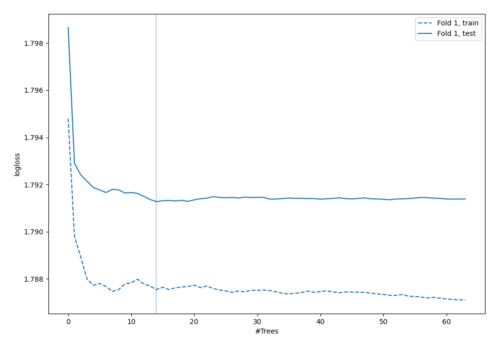
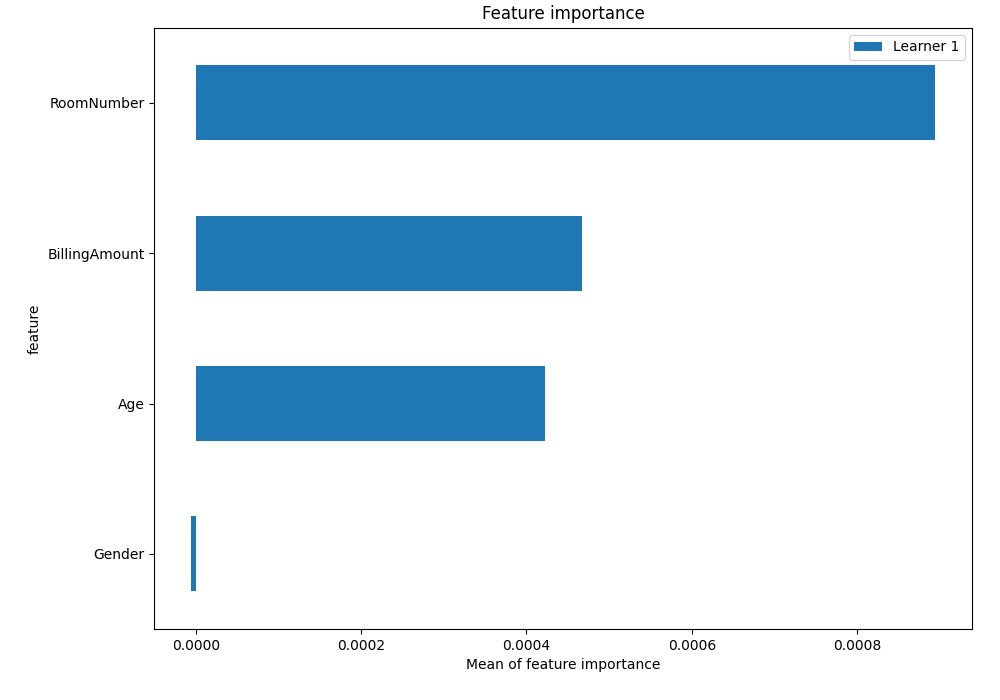
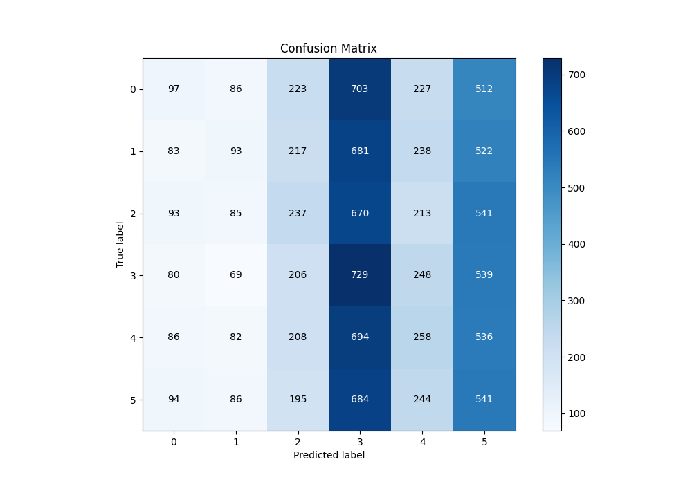
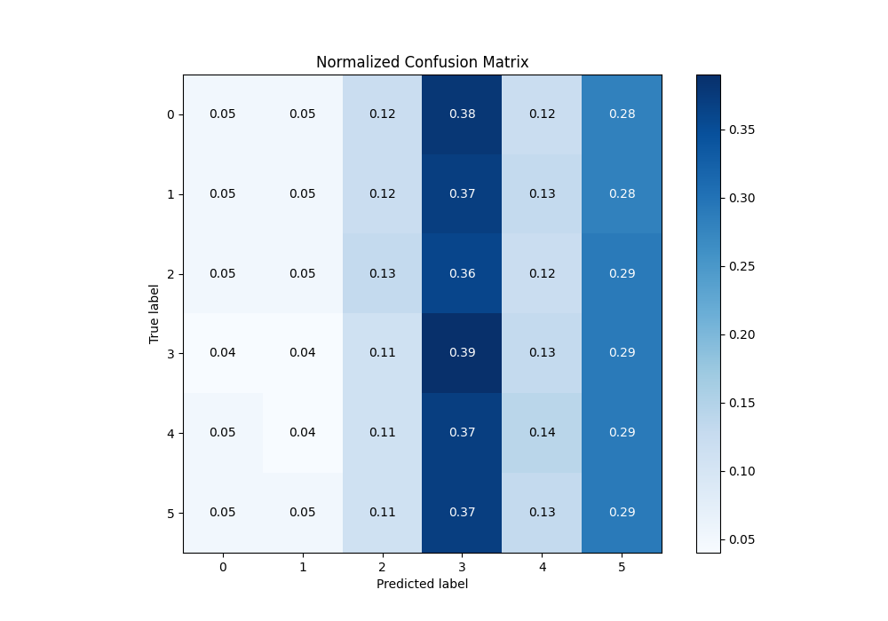
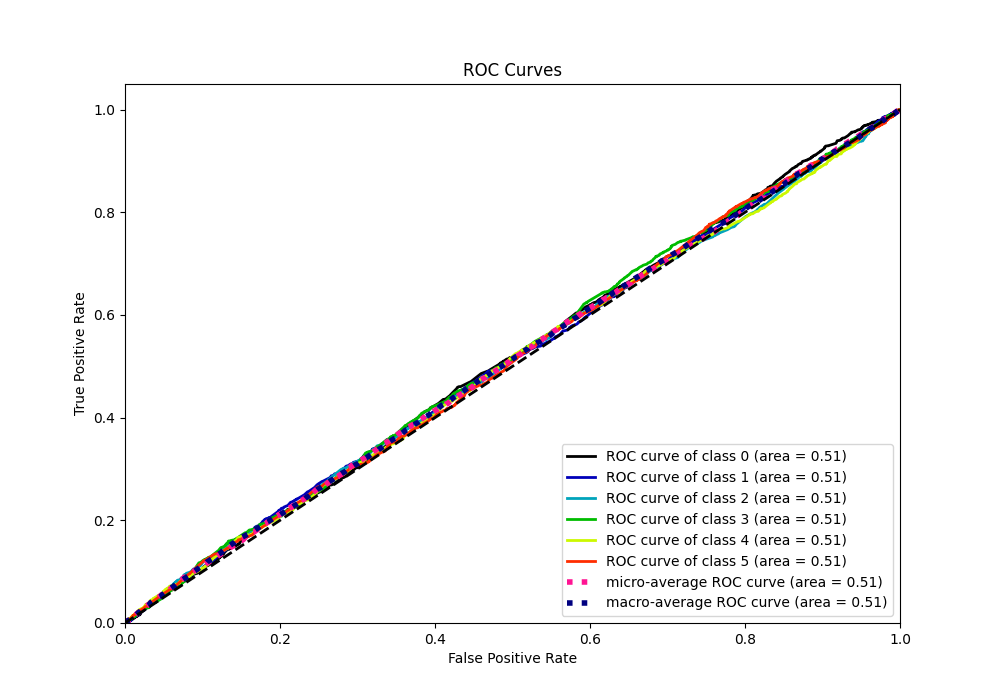
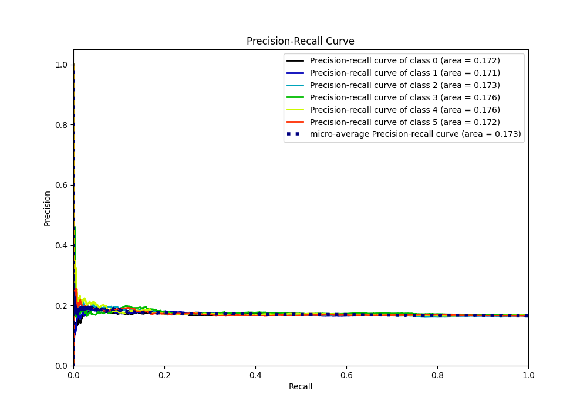

# Summary of 5_Default_RandomForest

[<< Go back](../README.md)

## Random Forest
- **n_jobs**: -1
- **criterion**: gini
- **max_features**: 0.9
- **min_samples_split**: 30
- **max_depth**: 4
- **eval_metric_name**: logloss
- **num_class**: 6
- **explain_level**: 2

## Validation
 - **validation_type**: split
 - **train_ratio**: 0.75
 - **shuffle**: True
 - **stratify**: True

## Optimized metric
logloss

## Training time

4.1 seconds

### Metric details
|           |            0 |            1 |           2 |           3 |           4 |           5 |   accuracy |    macro avg |   weighted avg |   logloss |
|:----------|-------------:|-------------:|------------:|------------:|------------:|------------:|-----------:|-------------:|---------------:|----------:|
| precision |    0.181989  |    0.185629  |    0.184292 |    0.175198 |    0.180672 |    0.169539 |   0.176126 |     0.179553 |       0.179538 |   1.79128 |
| recall    |    0.0524892 |    0.0507088 |    0.128874 |    0.389631 |    0.138412 |    0.293384 |   0.176126 |     0.175583 |       0.176126 |   1.79128 |
| f1-score  |    0.0814784 |    0.0796574 |    0.15168  |    0.241711 |    0.156744 |    0.214896 |   0.176126 |     0.154361 |       0.15462  |   1.79128 |
| support   | 1848         | 1834         | 1839        | 1871        | 1864        | 1844        |   0.176126 | 11100        |   11100        |   1.79128 |

## Confusion matrix
|              |   Predicted as 0 |   Predicted as 1 |   Predicted as 2 |   Predicted as 3 |   Predicted as 4 |   Predicted as 5 |
|:-------------|-----------------:|-----------------:|-----------------:|-----------------:|-----------------:|-----------------:|
| Labeled as 0 |               97 |               86 |              223 |              703 |              227 |              512 |
| Labeled as 1 |               83 |               93 |              217 |              681 |              238 |              522 |
| Labeled as 2 |               93 |               85 |              237 |              670 |              213 |              541 |
| Labeled as 3 |               80 |               69 |              206 |              729 |              248 |              539 |
| Labeled as 4 |               86 |               82 |              208 |              694 |              258 |              536 |
| Labeled as 5 |               94 |               86 |              195 |              684 |              244 |              541 |

## Learning curves

## Permutation-based Importance

## Confusion Matrix

## Normalized Confusion Matrix

## ROC Curve

## Precision Recall Curve

[<< Go back](../README.md)
