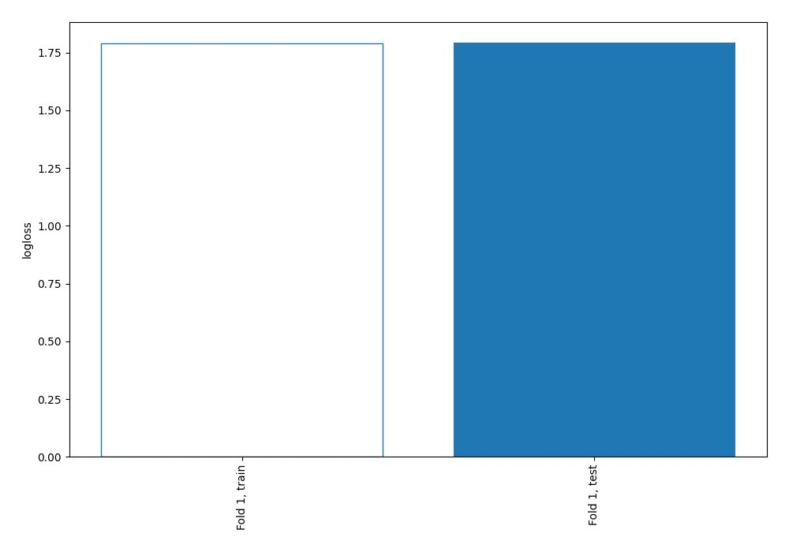
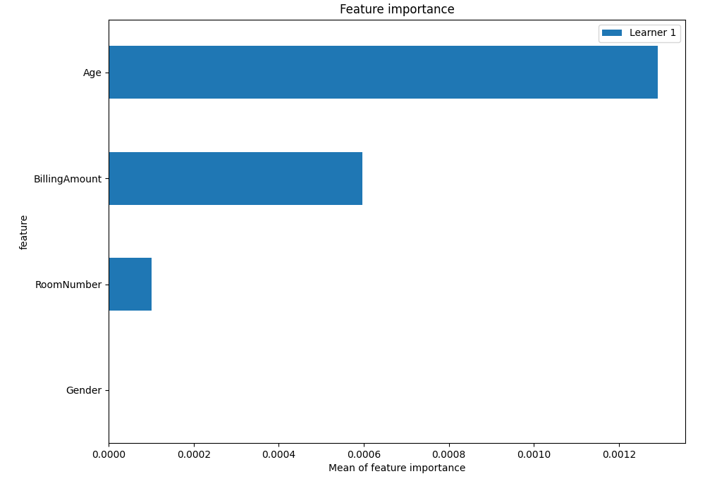
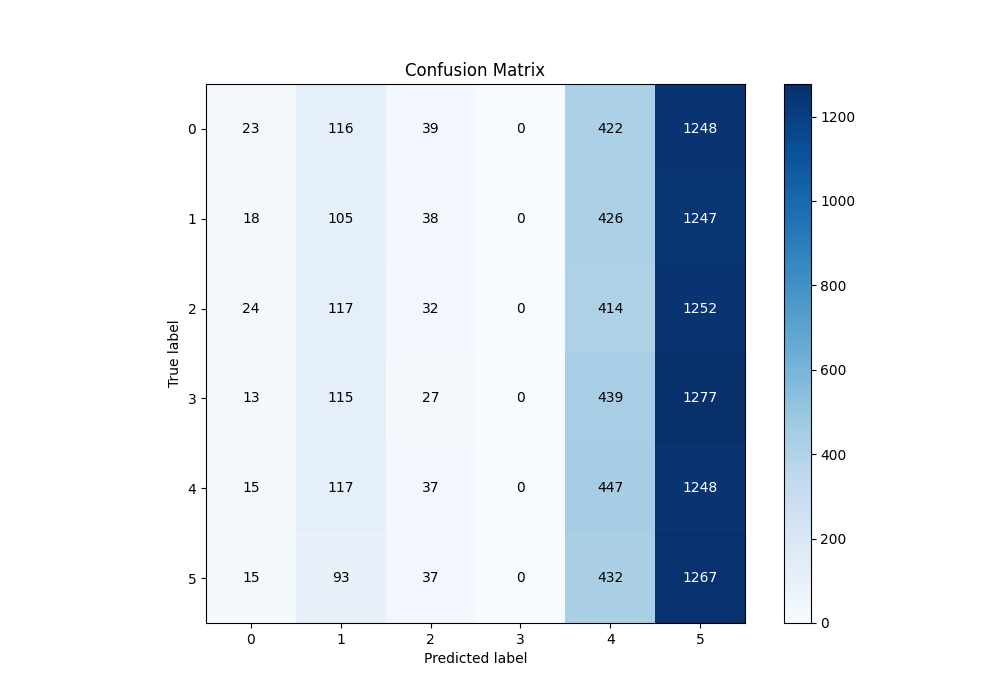
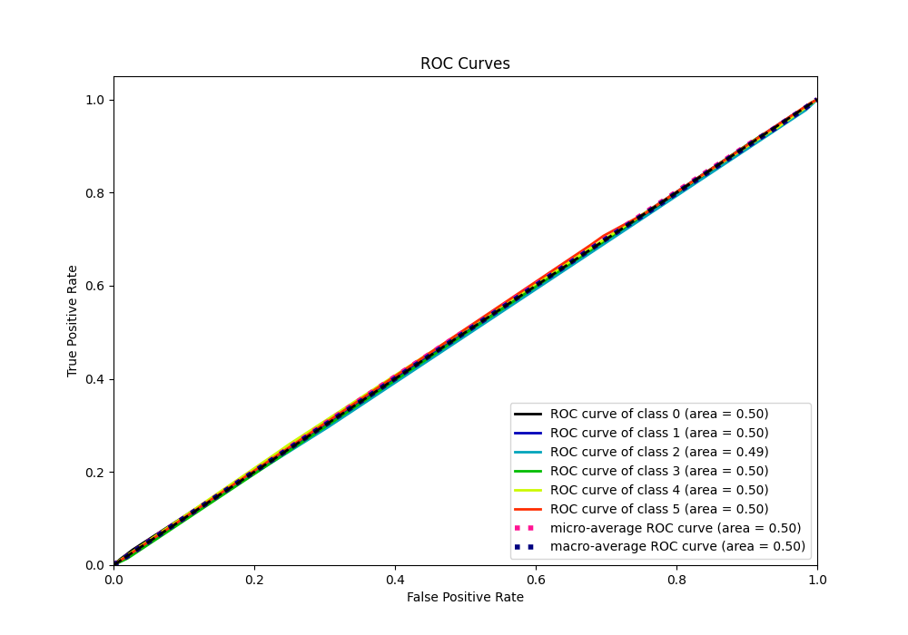
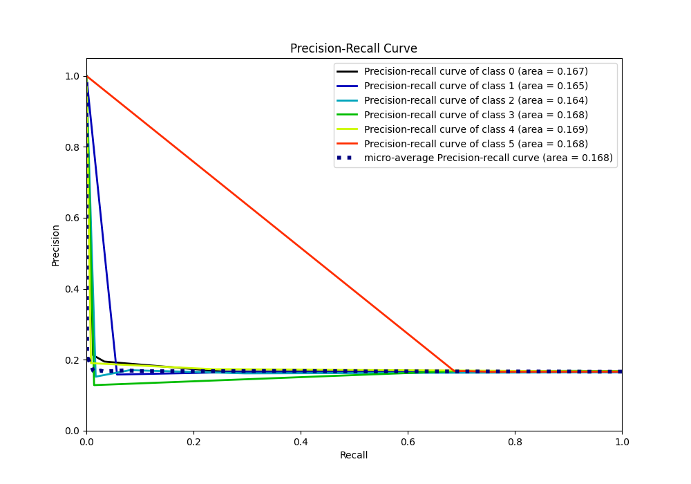

# Summary of 2_DecisionTree

[<< Go back](../README.md)

## Decision Tree
- **n_jobs**: -1
- **criterion**: gini
- **max_depth**: 3
- **num_class**: 6
- **explain_level**: 2

## Validation
 - **validation_type**: split
 - **train_ratio**: 0.75
 - **shuffle**: True
 - **stratify**: True

## Optimized metric
logloss

## Training time

9.8 seconds

### Metric details
|           |            0 |            1 |            2 |    3 |           4 |           5 |   accuracy |    macro avg |   weighted avg |   logloss |
|:----------|-------------:|-------------:|-------------:|-----:|------------:|------------:|-----------:|-------------:|---------------:|----------:|
| precision |    0.212963  |    0.158371  |    0.152381  |    0 |    0.173256 |    0.168059 |   0.168829 |     0.144172 |       0.143882 |   1.79253 |
| recall    |    0.0124459 |    0.0572519 |    0.0174008 |    0 |    0.239807 |    0.687093 |   0.168829 |     0.169    |       0.168829 |   1.79253 |
| f1-score  |    0.0235174 |    0.0841009 |    0.0312347 |    0 |    0.20117  |    0.270063 |   0.168829 |     0.101681 |       0.101632 |   1.79253 |
| support   | 1848         | 1834         | 1839         | 1871 | 1864        | 1844        |   0.168829 | 11100        |   11100        |   1.79253 |

## Confusion matrix
|              |   Predicted as 0 |   Predicted as 1 |   Predicted as 2 |   Predicted as 3 |   Predicted as 4 |   Predicted as 5 |
|:-------------|-----------------:|-----------------:|-----------------:|-----------------:|-----------------:|-----------------:|
| Labeled as 0 |               23 |              116 |               39 |                0 |              422 |             1248 |
| Labeled as 1 |               18 |              105 |               38 |                0 |              426 |             1247 |
| Labeled as 2 |               24 |              117 |               32 |                0 |              414 |             1252 |
| Labeled as 3 |               13 |              115 |               27 |                0 |              439 |             1277 |
| Labeled as 4 |               15 |              117 |               37 |                0 |              447 |             1248 |
| Labeled as 5 |               15 |               93 |               37 |                0 |              432 |             1267 |

## Learning curves

## Permutation-based Importance

## Confusion Matrix

## Normalized Confusion Matrix

## ROC Curve

## Precision Recall Curve

[<< Go back](../README.md)
