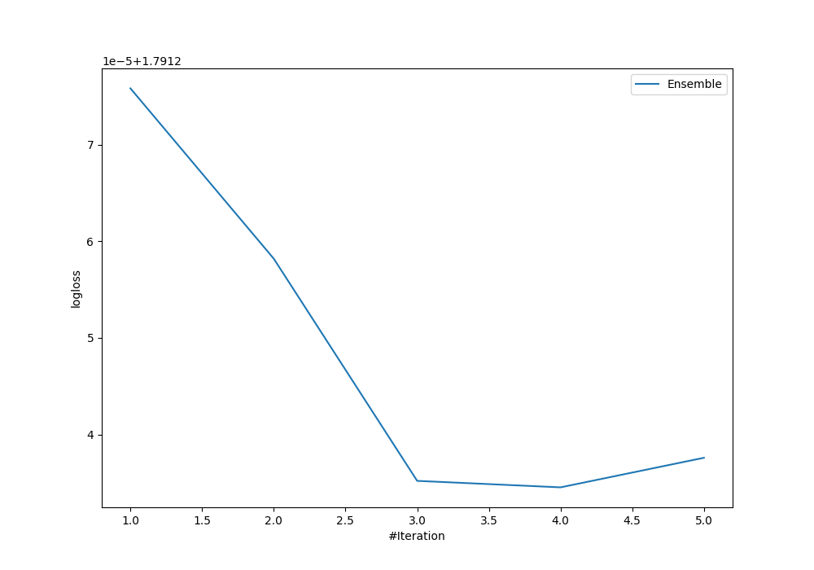
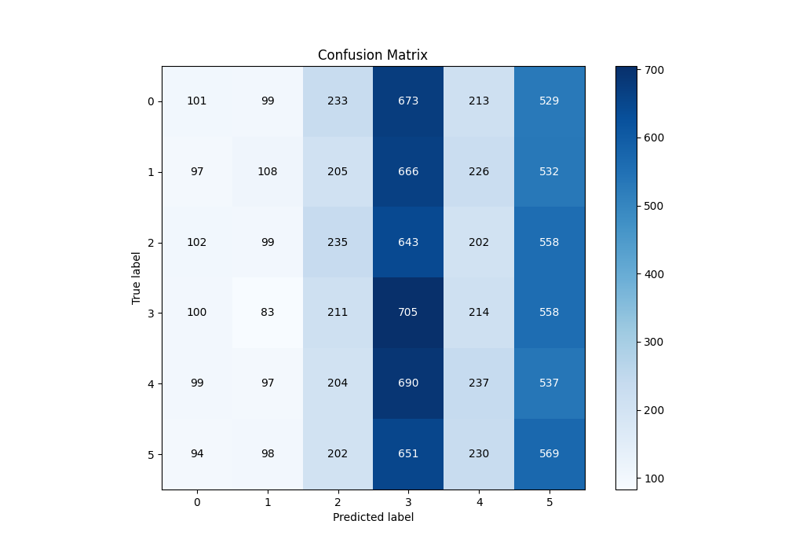
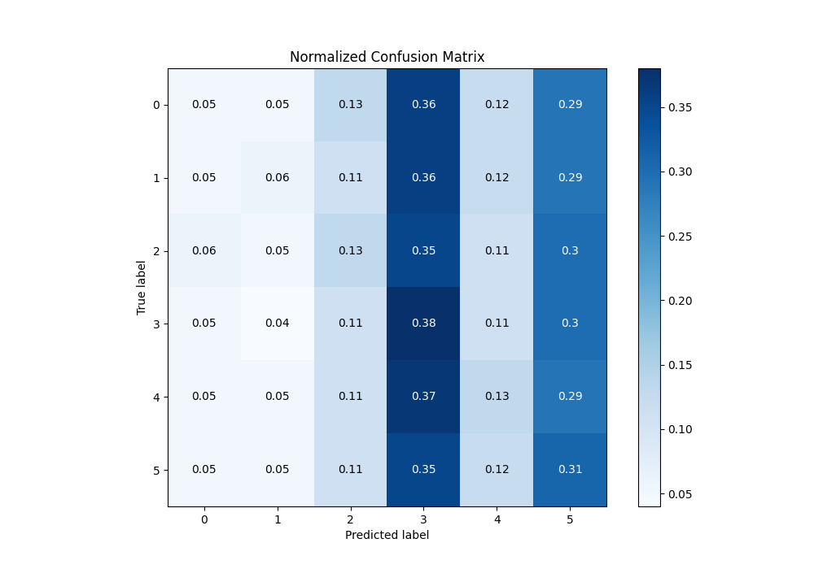
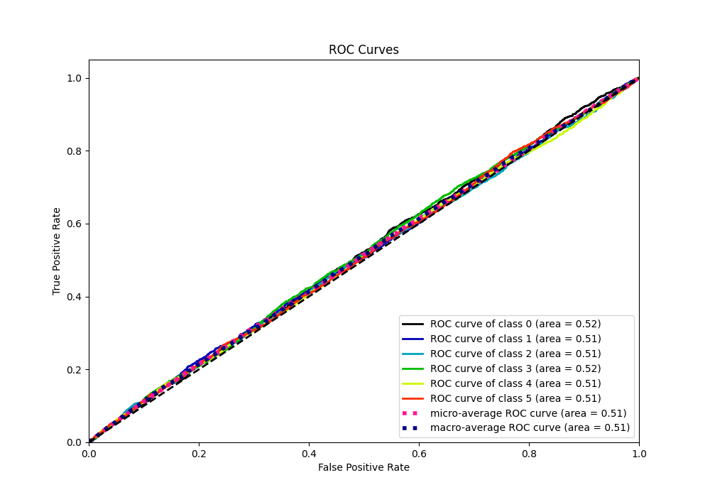
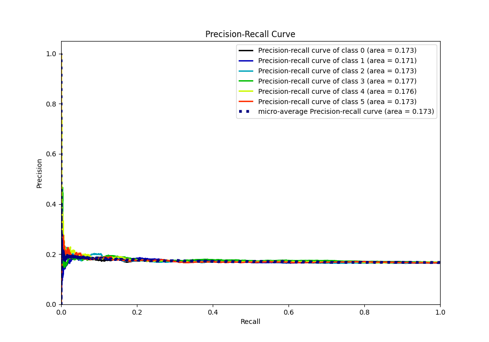

# Summary of Ensemble

[<< Go back](../README.md)

## Ensemble structure
| Model                  |   Weight |
|:-----------------------|---------:|
| 3_Default_Xgboost      |        1 |
| 5_Default_RandomForest |        3 |

### Metric details
|           |            0 |            1 |           2 |           3 |           4 |           5 |   accuracy |    macro avg |   weighted avg |   logloss |
|:----------|-------------:|-------------:|------------:|------------:|------------:|------------:|-----------:|-------------:|---------------:|----------:|
| precision |    0.17032   |    0.184932  |    0.182171 |    0.175025 |    0.179274 |    0.173317 |   0.176126 |     0.177506 |       0.177492 |   1.79123 |
| recall    |    0.0546537 |    0.0588877 |    0.127787 |    0.376804 |    0.127146 |    0.308568 |   0.176126 |     0.175641 |       0.176126 |   1.79123 |
| f1-score  |    0.082753  |    0.08933   |    0.150208 |    0.239024 |    0.148776 |    0.221962 |   0.176126 |     0.155342 |       0.155569 |   1.79123 |
| support   | 1848         | 1834         | 1839        | 1871        | 1864        | 1844        |   0.176126 | 11100        |   11100        |   1.79123 |

## Confusion matrix
|              |   Predicted as 0 |   Predicted as 1 |   Predicted as 2 |   Predicted as 3 |   Predicted as 4 |   Predicted as 5 |
|:-------------|-----------------:|-----------------:|-----------------:|-----------------:|-----------------:|-----------------:|
| Labeled as 0 |              101 |               99 |              233 |              673 |              213 |              529 |
| Labeled as 1 |               97 |              108 |              205 |              666 |              226 |              532 |
| Labeled as 2 |              102 |               99 |              235 |              643 |              202 |              558 |
| Labeled as 3 |              100 |               83 |              211 |              705 |              214 |              558 |
| Labeled as 4 |               99 |               97 |              204 |              690 |              237 |              537 |
| Labeled as 5 |               94 |               98 |              202 |              651 |              230 |              569 |

## Learning curves

## Confusion Matrix

## Normalized Confusion Matrix

## ROC Curve

## Precision Recall Curve

[<< Go back](../README.md)
